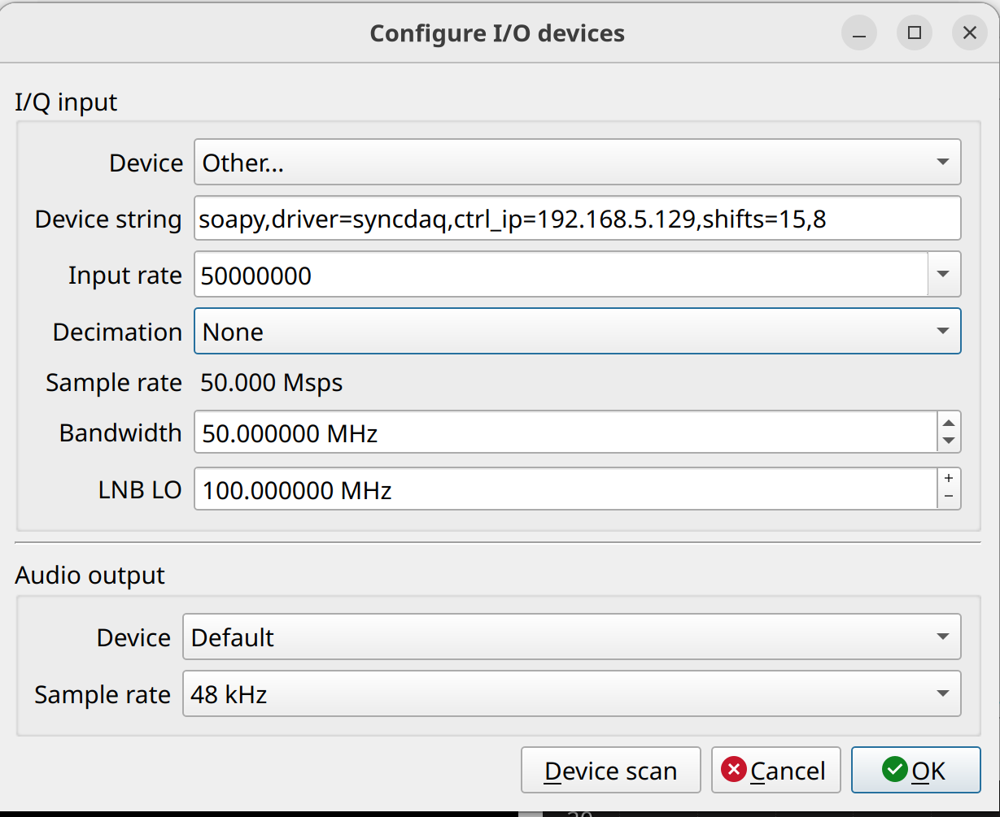

# [syncdaq](https://github.com/astrojhgu/syncdaq)的[soapysdr](https://github.com/pothosware/SoapySDR/tree/master)驱动

# 依赖库
soapysdr及其python绑定（可选）

ubuntu系统下的安装方法参见
[soapy的文档](https://github.com/pothosware/PothosCore/wiki/Ubuntu)

# 编译方法
1. 将本仓库目录置于和[syncdaq](https://github.com/astrojhgu/syncdaq)的同一层父目录中
2. 编译syncdaq:
```bash
cd syncdaq
cargo build --release
```
3. 进入本仓库目录
```bash
cd ../soapy_syncdaq
make clean && make
```

编译后会得到c文件

# 使用方法
## 设置环境变量
确保设置`SOAPY_SDR_PLUGIN_PATH`环境变量，并将`libsoapy_syncdaq.so`所在路径包含在内。

假设编译成功后没有改变过当前路径，可以执行下述命令

```bash
export SOAPY_SDR_PLUGIN_PATH=$PWD
```

## 预先配置100G端口参数
**重要: 如果100G 端口的目标mac/ip地址与本机上存在的100G网口的mac/ip地址不匹配，设备将无法被发现。这是由设备发现机制决定的**

参见[syncdaq文档](https://github.com/astrojhgu/syncdaq)

## 使用`SoapySDRUtil`发现设备
假设设备已经成功获取了控制端口的IP地址，并且该IP地址和运行`soapysdr`的电脑位于同一个子网中，可以执行下述命令发现设备
```bash
SoapySDRUtil --find
```

如果子网中有多个syncdaq设备，则需要显式指定其控制ip。假设其控制ip地址为`192.168.5.129`，那么可以使用如下命令
```bash
SoapySDRUtil --find="driver=syncdaq,ctrl_ip=192.168.5.129"
```

## `soapysdr`的参数

|参数|取值|备注|
|---|----|---|
|driver|syncdaq|固定值用于选中本设备类型|
|ctrl_ip|控制端口的ip地址|可选参数，如果子网中仅有一个设备则不必设置|
|init_file|用于初始化设备的的参数文件|可选，用于完成时钟设置、同步等|
|port_id|`[0,7]`|射频端口编号|
|shifts|`"s1:s2:s3..."`|注意不包含引号，用冒号隔开的若干整数，最后一个代表抗混叠滤波器的整数位移量，前面的代表各级1/2下抽样的位移量，注意实际采样率等于`100 MSps/(1<<(ns-1))`，其中ns为总的位移量的个数|

一个完整的参数列表例子:

```bash
SoapySDRUtil --make="driver=syncdaq,ctrl_ip=192.168.5.129,port_id=1,init_file=init_rfsoc.yaml,shifts=15:8"
```

## 在`gqrx`中使用
按照如下参数进行配置
```
soapy,driver=syncdaq,ctrl_ip=192.168.5.129,shifts=15,8
```
其中`shifts`参数需要测试，其它参数如下图所示。


